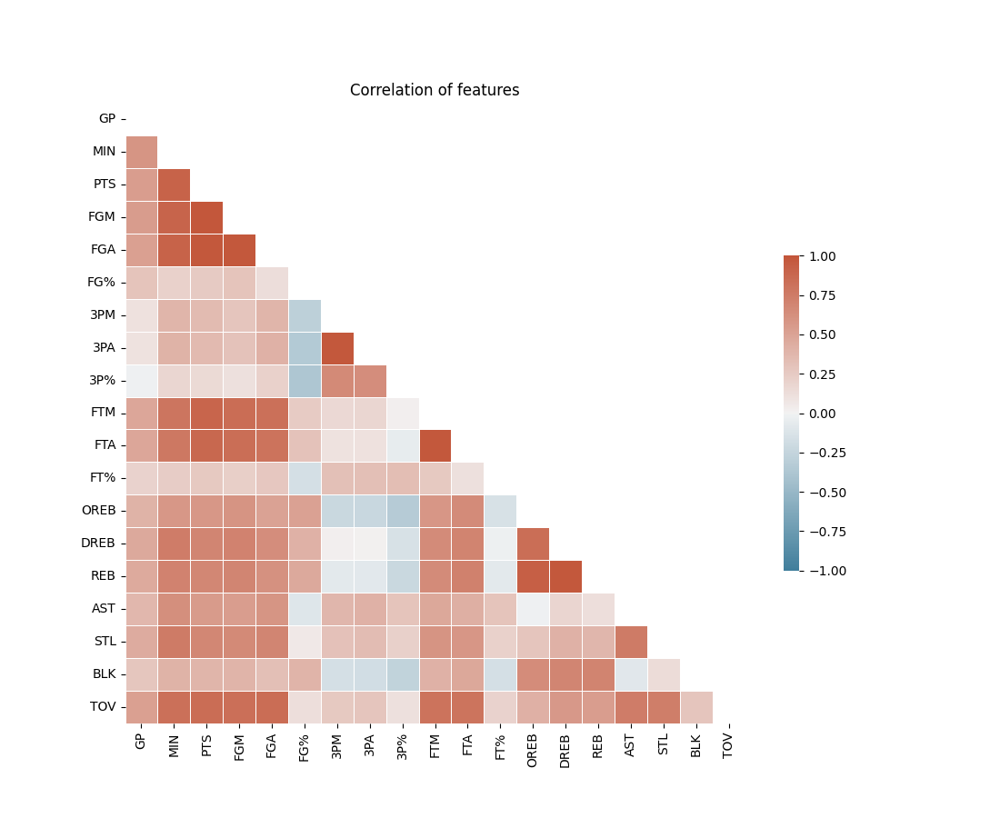
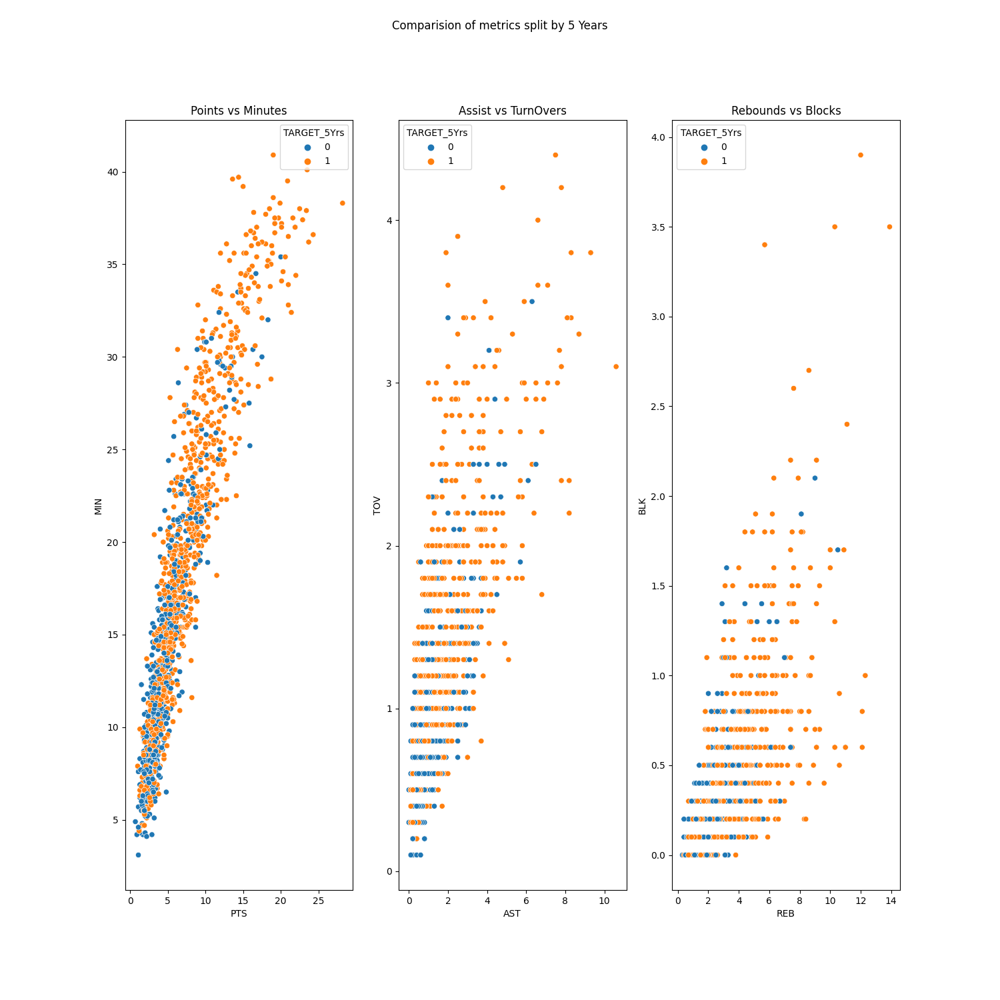

# NBA Rookie Data Analysis / Classification

This project is for me to practice with some data analysis techniques in Python.
Whilst the dataset is relatively simple, it is still interesting to find some of the patterns within the data.

The original dataset came from [here](https://data.world/exercises/logistic-regression-exercise-1). This data only had 1,340 rows.

## Initial Exploratory Analysis

Initially, I performed some exploratory analysis on the dataset.

Some of the 3P% field is missing values. We can correct this using a defined lambda function, as we know that 3P% = 3PM / 3PA * 100:

```
df['3P%'] = df.apply(lambda row: (weird_division(row['3PM'], row['3PA'])) * 100, axis=1)
```

I then produced some meaningful graphs. These can be see below:

[](graphs/heatmap.png)

[](graphs/comparisions.png)


## Classification

I am also testing out different classification models in Python in order to predict if the Rookie will stay in the league for 5+ years.

### Sci-Kit Learn

Initially, I used sci-kit learn to train a XGBoost Classifier, a SVM and a Random Forst Classifier.

The XGBoost provided the best results with a 0.70 accuracy.

### Dataiku

I also wanted to use Dataiku Auto-ML feature to produce classification models. After uploading the dataset into Dataiku, I perform some data cleaning, similar to the python script but using Dataiku Visual Prepare Recipe to gain more experience with Dataiku. I then trained some models on the data. The models I used were: Random Forest, Logistic Regression, XGBoost and an ANN.

The best model was a logistic regression model with a 0.718 accuracy and 0.762 ROC AUC.

## Grabbing More Data

As these accuracies are clearly quite low, I thought it would be best to grab more data. For this I used [basketball reference](basketball-reference.com). For this I'm using selenium.
